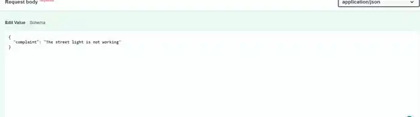
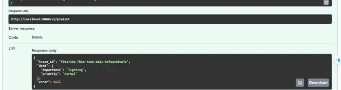
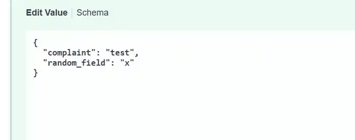
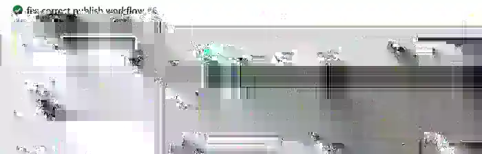
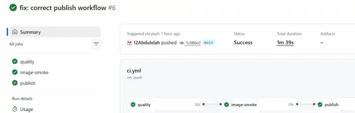

# Muwajjih

Muwajjih is my SDA-AIE-113 capstone project.

It receives a short municipal or government complaint and returns:

- the predicted department
- the priority: `normal` or `urgent`

The department is predicted using a lightweight scikit-learn model. Emergency phrases such as `fire` and `gas leak` are handled by a deterministic rule, so they always return `urgent`.

## Requirements

- Python 3.11 or 3.12
- Docker Desktop
- Docker Compose
- Make

## Setup

Create and activate a virtual environment, then install the project:

```bash
python -m venv .venv
pip install -e ".[dev,train]"
```

## Train the model

```bash
make train
```

The training data is synthetic and contains 12,000 complaint records.

## Run tests

```bash
make test
```

The project includes unit, integration, and behavioural tests. Behavioural tests cover invariance, directional behaviour, and a golden reference file.

## Run the API

```bash
make run
```

The API runs on port 8000.

Main endpoints:

- `POST /v1/predict`
- `GET /health`
- `GET /ready`

Example request:

```json
{
  "complaint": "There is a gas leak near my building"
}
```

Example response:

```json
{
  "trace_id": "generated-trace-id",
  "data": {
    "department": "public_safety",
    "priority": "urgent"
  },
  "error": null
}
```

## Docker

Build the image:

```bash
make image
```

Run the smoke test:

```bash
make smoke
```

Run the service with Docker Compose:

```bash
make up
```

The Compose setup runs the API with a supporting readiness-monitor service that starts only after the API becomes healthy.

## CI/CD

GitHub Actions runs:

1. secret scan, lint, type-check, and tests
2. Docker image smoke test
3. GHCR publish on merge to `main`

Published images are tagged with the commit SHA.

## Configuration

Configuration uses typed settings with the `MUWAJJIH_` prefix. Example values are provided in `.env.example`. Secrets are not stored in the repository.

## Extension

The emergency policy also supports Arabic emergency phrases for fire and gas leaks.


This project was completed as part of the SDA-AIE-113 — Software Engineering Practices for AI Systems training program at SDAIA Academy, under the supervision of Abdullah Khalid AlShahrani.

The portfolio demonstrates the practical application of software engineering practices for AI systems — building a production-style AI/ML service through clean architecture, a well-defined API contract, containerization, a layered automated testing suite, a CI/CD pipeline with branch protection, and safe configuration, secrets, and logging management.

Official SDAIA Academy GitHub:

https://github.com/SDAIAAcademy

## Demo Evidence

The following screenshots document the main live-demo flow and CI/CD evidence.

### 1. Valid prediction request



### 2. Valid prediction response



### 3. Strict validation with an unexpected field



### 4. Validation error response



### 5. CI/CD pipeline


